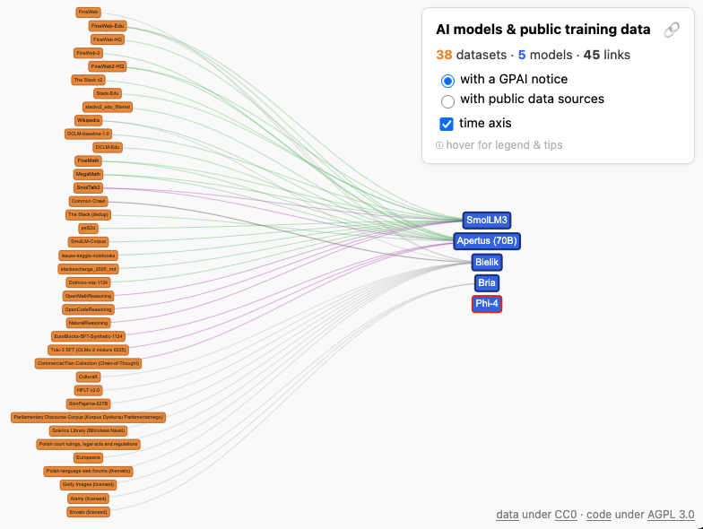

# Public AI Data Sources Viz

What AI models use what public datasets?
Which ones comply with EU's [AI Act Article 53(1)(d)](https://ai-act-service-desk.ec.europa.eu/en/ai-act/article-53), which ones don't?

This visualisation project builds on [this knowledge graph](https://public-ai-data-sources.wikibase.cloud/) of public AI metadata to respond to these questions at a glance. Public datasets on the left are linked to the AI models that use them on the right.

If anything seems missing or incorrect, please feel free to directly update the data on the wikibase directly, or to submit an issue [here](https://github.com/mrmvn/public-ai-data-viz/issues/new).

[This codebase](https://github.com/mrmvn/public-ai-data-viz) is licensed under [AGPL 3.0](LICENSE).
Data from this [wikibase](https://public-ai-data-sources.wikibase.cloud/) is licensed under [CC0](https://creativecommons.org/publicdomain/zero/1.0/). 
